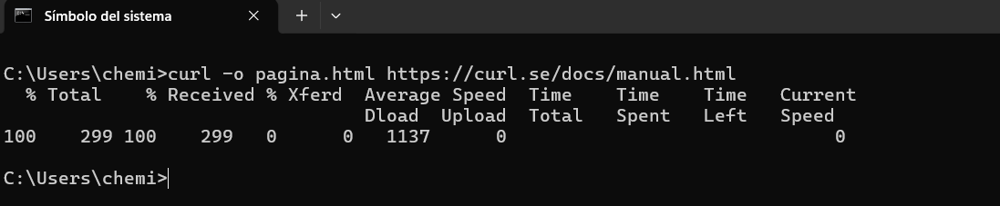

# Actividad 0.4 - Usando cUrl

## ¿Qué es cURL?
`cURL` (*Client URL*) es una herramienta de línea de comandos y biblioteca creada por Daniel Stenberg utilizada para transferir datos desde o hacia un servidor utilizando una amplia variedad de protocolos (HTTP, HTTPS, FTP, FTPS, SFTP, SCP, SMTP, etc.). 

Es fundamental en el desarrollo web y la administración de sistemas para probar APIs, automatizar descargas y diagnosticar conexiones de red.

---

## 5 Ejemplos Prácticos de Uso

### 1. Obtener el contenido de una URL y guardarlo en un archivo (`-o`)
Descarga el contenido HTML de un sitio web y lo guarda con un nombre específico en tu equipo:

`curl -o manual.html [https://curl.se/docs/manual.html](https://curl.se/docs/manual.html)`

### 2. Guardar el archivo conservando su nombre original (-O)
Descarga un archivo remoto y utiliza el mismo nombre que tiene en el servidor:

`curl -O [https://curl.se/logo/curl-logo.png](https://curl.se/logo/curl-logo.png)`

### 3. Inspeccionar encabezados HTTP (-I)
Obtiene únicamente las cabeceras de la respuesta (código de estado, tipo de contenido, servidor) sin descargar el cuerpo.

`curl -I [https://curl.se/](https://curl.se/)`

### 4. Seguir redirecciones de URL (-L)
Si el servidor responde con una redirección (301 o 302), fuerza a cURL a seguir la nueva dirección hasta la respuesta final.

`curl -L -I [http://google.com](http://google.com)`

### 5. Enviar una petición POST con parámetros (-d)
Envía datos en el cuerpo de la solicitud HTTP POST hacia una API o formulario.

`curl -X POST -d "usuario=admin&clave=12345" [https://httpbin.org/post](https://httpbin.org/post)`

